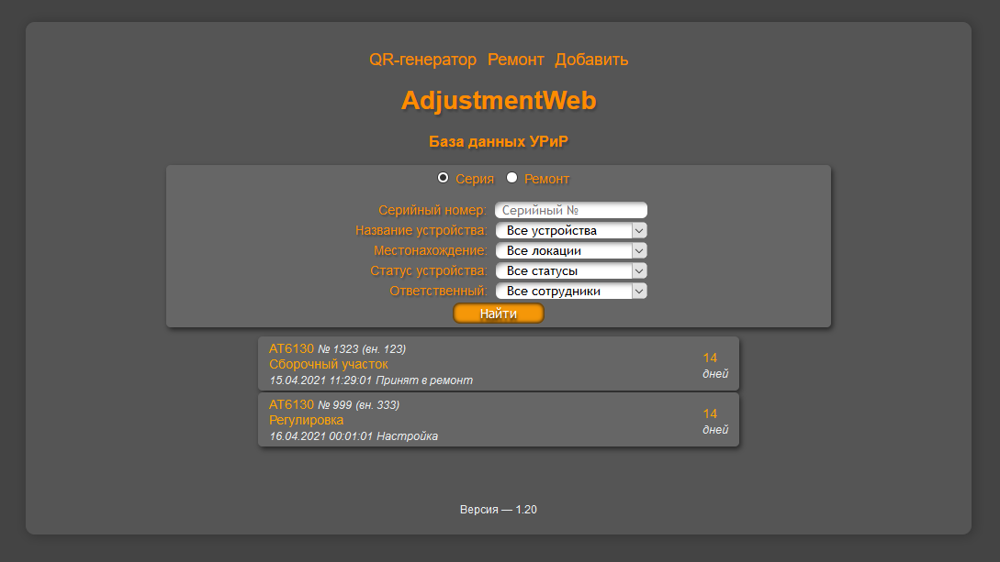

# AdjustmentWeb 1.21    
### <i>Веб морда для облачной базы данных для УРиР. Мониторинг статуса устройств (на линейке, готов и т.д.). Отображение данных, загруженных с помощью AdjustmentDB (общая база данных)</i> 

[Список версий](./VERSION.md)

[comment]: <> (![alt tag]&#40;fon.png&#41;)
